# [📈 Live Status](https://AlexJenter.github.io/upptime): <!--live status--> **🟧 Partial outage**

Monitored Sites for [upset.ch](upset.ch) and personal sites

<!--start: status pages-->
<!-- This summary is generated by Upptime (https://github.com/upptime/upptime) -->
<!-- Do not edit this manually, your changes will be overwritten -->
<!-- prettier-ignore -->
| URL | Status | History | Response Time | Uptime |
| --- | ------ | ------- | ------------- | ------ |
|  [Upset Studio](https://upset.ch) | 🟩 Up | [upset-studio.yml](https://github.com/AlexJenter/upptime/commits/HEAD/history/upset-studio.yml) | 

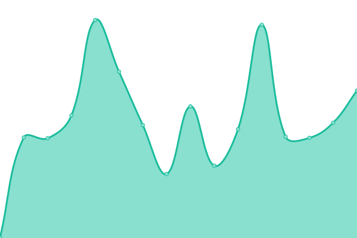 1332ms
     
 | 

<a href="https://AlexJenter.github.io/upptime/history/upset-studio">98.66%</a>
    

|  [Benjam von Wyl](https://www.benjaminvonwyl.ch/) | 🟩 Up | [benjam-von-wyl.yml](https://github.com/AlexJenter/upptime/commits/HEAD/history/benjam-von-wyl.yml) | 

 639ms
     
 | 

<a href="https://AlexJenter.github.io/upptime/history/benjam-von-wyl">100.00%</a>
    

|  [Brutalist Websites](https://brutalistwebsites.com/) | 🟩 Up | [brutalist-websites.yml](https://github.com/AlexJenter/upptime/commits/HEAD/history/brutalist-websites.yml) | 

 2416ms
     
 | 

<a href="https://AlexJenter.github.io/upptime/history/brutalist-websites">100.00%</a>
    

|  [Brutalist Websites Shop](https://shop.brutalistwebsites.com/) | 🟩 Up | [brutalist-websites-shop.yml](https://github.com/AlexJenter/upptime/commits/HEAD/history/brutalist-websites-shop.yml) | 

 898ms
     
 | 

<a href="https://AlexJenter.github.io/upptime/history/brutalist-websites-shop">100.00%</a>
    

|  [CAS in theory and history of photography](https://www.cas-photography.ch/en) | 🟥 Down | [cas-in-theory-and-history-of-photography.yml](https://github.com/AlexJenter/upptime/commits/HEAD/history/cas-in-theory-and-history-of-photography.yml) | 

 0ms
     
 | 

<a href="https://AlexJenter.github.io/upptime/history/cas-in-theory-and-history-of-photography">97.57%</a>
    

|  [Chez Wang](https://chez.wang) | 🟥 Down | [chez-wang.yml](https://github.com/AlexJenter/upptime/commits/HEAD/history/chez-wang.yml) | 

 931ms
     
 | 

<a href="https://AlexJenter.github.io/upptime/history/chez-wang">97.57%</a>
    

|  [Collegium](https://collegium.ethz.ch) | 🟥 Down | [collegium.yml](https://github.com/AlexJenter/upptime/commits/HEAD/history/collegium.yml) | 

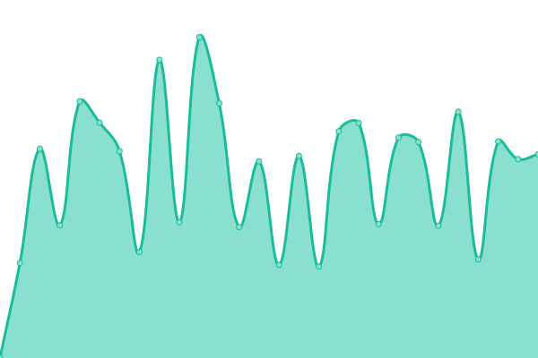 975ms
     
 | 

<a href="https://AlexJenter.github.io/upptime/history/collegium">97.57%</a>
    

|  [Das Narr](https://dasnarr.ch/) | 🟥 Down | [das-narr.yml](https://github.com/AlexJenter/upptime/commits/HEAD/history/das-narr.yml) | 

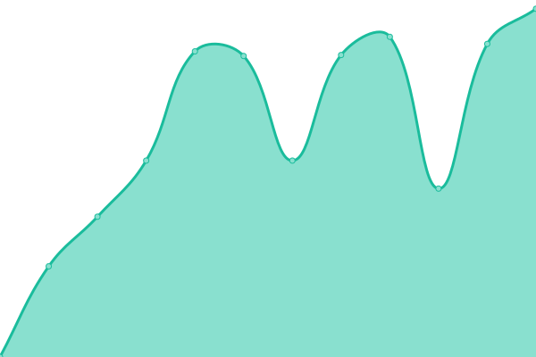 4267ms
     
 | 

<a href="https://AlexJenter.github.io/upptime/history/das-narr">99.13%</a>
    

|  [Forum Schlossplatz](https://www.forumschlossplatz.ch/) | 🟥 Down | [forum-schlossplatz.yml](https://github.com/AlexJenter/upptime/commits/HEAD/history/forum-schlossplatz.yml) | 

 1648ms
     
 | 

<a href="https://AlexJenter.github.io/upptime/history/forum-schlossplatz">98.40%</a>
    

|  [Giubbini Architekten](https://giubbini.ch/) | 🟥 Down | [giubbini-architekten.yml](https://github.com/AlexJenter/upptime/commits/HEAD/history/giubbini-architekten.yml) | 

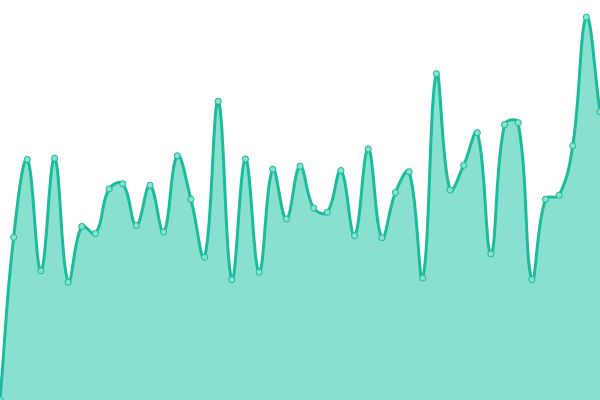 944ms
     
 | 

<a href="https://AlexJenter.github.io/upptime/history/giubbini-architekten">97.73%</a>
    

|  [Hope Fight Love](https://hopefightlove.ch) | 🟥 Down | [hope-fight-love.yml](https://github.com/AlexJenter/upptime/commits/HEAD/history/hope-fight-love.yml) | 

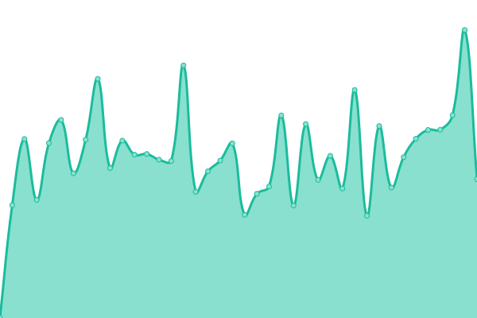 761ms
     
 | 

<a href="https://AlexJenter.github.io/upptime/history/hope-fight-love">97.73%</a>
    

|  [Katrin Luchsinger](https://www.katrinluchsinger.ch) | 🟥 Down | [katrin-luchsinger.yml](https://github.com/AlexJenter/upptime/commits/HEAD/history/katrin-luchsinger.yml) | 

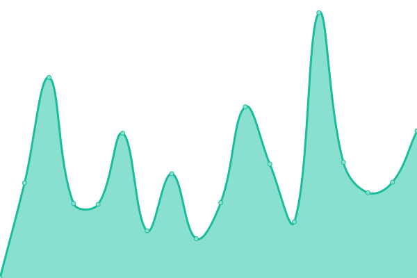 1907ms
     
 | 

<a href="https://AlexJenter.github.io/upptime/history/katrin-luchsinger">99.14%</a>
    

|  [Kiff](https://kiff.ch) | 🟩 Up | [kiff.yml](https://github.com/AlexJenter/upptime/commits/HEAD/history/kiff.yml) | 

 1251ms
     
 | 

<a href="https://AlexJenter.github.io/upptime/history/kiff">95.56%</a>
    

|  [Kiff – We make it](https://kiff2026.ch/) | 🟥 Down | [kiff-we-make-it.yml](https://github.com/AlexJenter/upptime/commits/HEAD/history/kiff-we-make-it.yml) | 

 1875ms
     
 | 

<a href="https://AlexJenter.github.io/upptime/history/kiff-we-make-it">99.14%</a>
    

|  [Kilian Ziegler](https://kilianziegler.ch) | 🟥 Down | [kilian-ziegler.yml](https://github.com/AlexJenter/upptime/commits/HEAD/history/kilian-ziegler.yml) | 

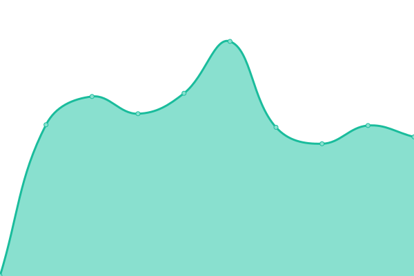 1517ms
     
 | 

<a href="https://AlexJenter.github.io/upptime/history/kilian-ziegler">98.43%</a>
    

|  [KUF Architekten](https://kufarchitekten.ch/) | 🟩 Up | [kuf-architekten.yml](https://github.com/AlexJenter/upptime/commits/HEAD/history/kuf-architekten.yml) | 

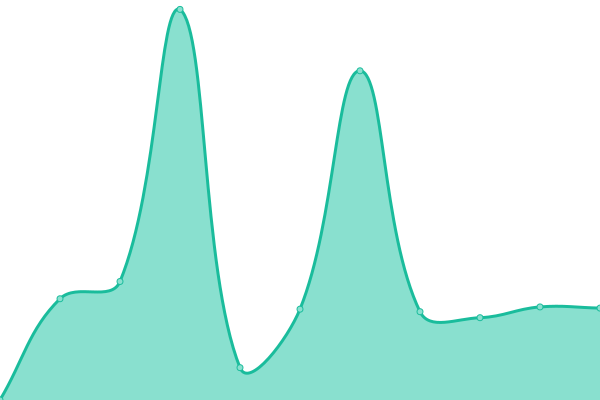 2553ms
     
 | 

<a href="https://AlexJenter.github.io/upptime/history/kuf-architekten">100.00%</a>
    

|  [Lisa Christ](https://www.lisachrist.ch) | 🟥 Down | [lisa-christ.yml](https://github.com/AlexJenter/upptime/commits/HEAD/history/lisa-christ.yml) | 

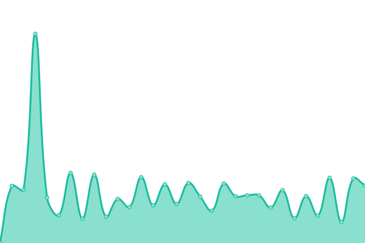 1237ms
     
 | 

<a href="https://AlexJenter.github.io/upptime/history/lisa-christ">97.50%</a>
    

|  [Susanne Boner](https://www.susanneboner.ch/) | 🟥 Down | [susanne-boner.yml](https://github.com/AlexJenter/upptime/commits/HEAD/history/susanne-boner.yml) | 

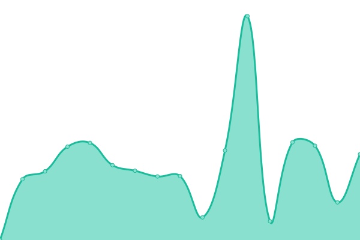 2117ms
     
 | 

<a href="https://AlexJenter.github.io/upptime/history/susanne-boner">99.14%</a>
    

|  [Zentrum Literarische Gegenwart](https://www.zentrumfuerliterarischegegenwart.ch/en) | 🟥 Down | [zentrum-literarische-gegenwart.yml](https://github.com/AlexJenter/upptime/commits/HEAD/history/zentrum-literarische-gegenwart.yml) | 

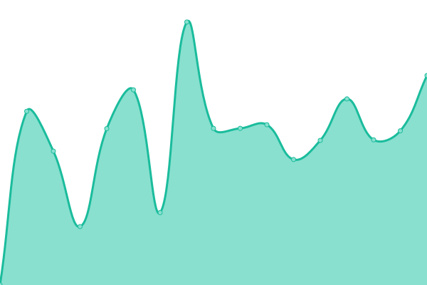 1790ms
     
 | 

<a href="https://AlexJenter.github.io/upptime/history/zentrum-literarische-gegenwart">99.14%</a>
    

|  [Zurich Aesthetics Lab](https://zurichaestheticslab.ch) | 🟥 Down | [zurich-aesthetics-lab.yml](https://github.com/AlexJenter/upptime/commits/HEAD/history/zurich-aesthetics-lab.yml) | 

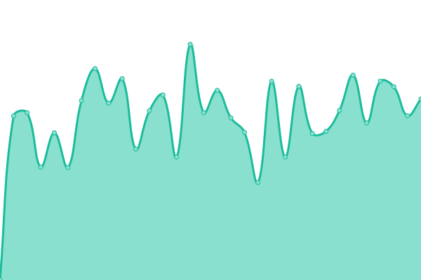 829ms
     
 | 

<a href="https://AlexJenter.github.io/upptime/history/zurich-aesthetics-lab">97.74%</a>
    

<!--end: status pages-->

[**Visit our status website →**](https://AlexJenter.github.io/upptime)

## 📄 License

- Powered by: [Upptime](https://github.com/upptime/upptime)
- Code: [MIT](./LICENSE) © [Anand Chowdhary](https://anandchowdhary.com), supported by [Pabio](https://pabio.com)
- Data in the `./history` directory: [Open Database License](https://opendatacommons.org/licenses/odbl/1-0/)
