# [📈 Live Status](https://AlexJenter.github.io/upptime): <!--live status--> **🟩 All systems operational**

Monitored Sites for [upset.ch](upset.ch) and personal sites

<!--start: status pages-->
<!-- This summary is generated by Upptime (https://github.com/upptime/upptime) -->
<!-- Do not edit this manually, your changes will be overwritten -->
<!-- prettier-ignore -->
| URL | Status | History | Response Time | Uptime |
| --- | ------ | ------- | ------------- | ------ |
|  [Upset Studio](https://upset.ch) | 🟩 Up | [upset-studio.yml](https://github.com/AlexJenter/upptime/commits/HEAD/history/upset-studio.yml) | 

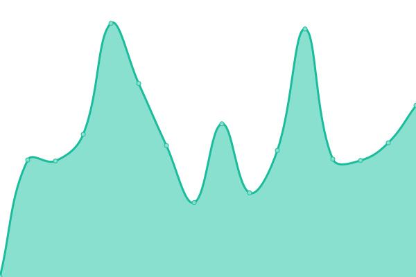 1065ms
     
 | 

<a href="https://AlexJenter.github.io/upptime/history/upset-studio">100.00%</a>
    

|  [Benjam von Wyl](https://www.benjaminvonwyl.ch/) | 🟩 Up | [benjam-von-wyl.yml](https://github.com/AlexJenter/upptime/commits/HEAD/history/benjam-von-wyl.yml) | 

 521ms
     
 | 

<a href="https://AlexJenter.github.io/upptime/history/benjam-von-wyl">100.00%</a>
    

|  [Brutalist Websites](https://brutalistwebsites.com/) | 🟩 Up | [brutalist-websites.yml](https://github.com/AlexJenter/upptime/commits/HEAD/history/brutalist-websites.yml) | 

 1338ms
     
 | 

<a href="https://AlexJenter.github.io/upptime/history/brutalist-websites">100.00%</a>
    

|  [Brutalist Websites Shop](https://shop.brutalistwebsites.com/) | 🟩 Up | [brutalist-websites-shop.yml](https://github.com/AlexJenter/upptime/commits/HEAD/history/brutalist-websites-shop.yml) | 

 772ms
     
 | 

<a href="https://AlexJenter.github.io/upptime/history/brutalist-websites-shop">100.00%</a>
    

|  [CAS in theory and history of photography](https://www.cas-photography.ch/en) | 🟩 Up | [cas-in-theory-and-history-of-photography.yml](https://github.com/AlexJenter/upptime/commits/HEAD/history/cas-in-theory-and-history-of-photography.yml) | 

 0ms
     
 | 

<a href="https://AlexJenter.github.io/upptime/history/cas-in-theory-and-history-of-photography">99.02%</a>
    

|  [Chez Wang](https://chez.wang) | 🟩 Up | [chez-wang.yml](https://github.com/AlexJenter/upptime/commits/HEAD/history/chez-wang.yml) | 

 1112ms
     
 | 

<a href="https://AlexJenter.github.io/upptime/history/chez-wang">99.03%</a>
    

|  [Collegium](https://collegium.ethz.ch) | 🟩 Up | [collegium.yml](https://github.com/AlexJenter/upptime/commits/HEAD/history/collegium.yml) | 

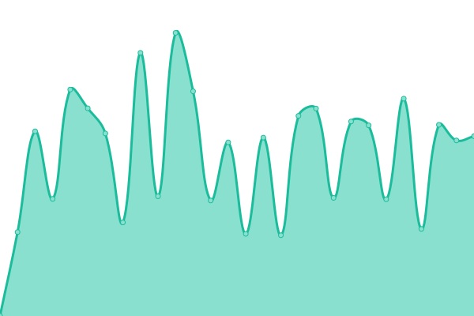 900ms
     
 | 

<a href="https://AlexJenter.github.io/upptime/history/collegium">99.03%</a>
    

|  [Das Narr](https://dasnarr.ch/) | 🟩 Up | [das-narr.yml](https://github.com/AlexJenter/upptime/commits/HEAD/history/das-narr.yml) | 

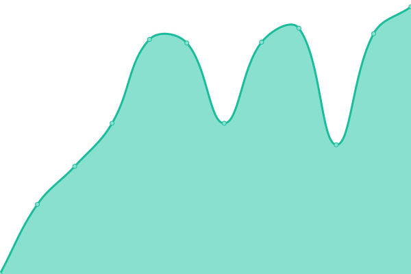 5681ms
     
 | 

<a href="https://AlexJenter.github.io/upptime/history/das-narr">100.00%</a>
    

|  [Forum Schlossplatz](https://www.forumschlossplatz.ch/) | 🟩 Up | [forum-schlossplatz.yml](https://github.com/AlexJenter/upptime/commits/HEAD/history/forum-schlossplatz.yml) | 

 1578ms
     
 | 

<a href="https://AlexJenter.github.io/upptime/history/forum-schlossplatz">99.62%</a>
    

|  [Giubbini Architekten](https://giubbini.ch/) | 🟩 Up | [giubbini-architekten.yml](https://github.com/AlexJenter/upptime/commits/HEAD/history/giubbini-architekten.yml) | 

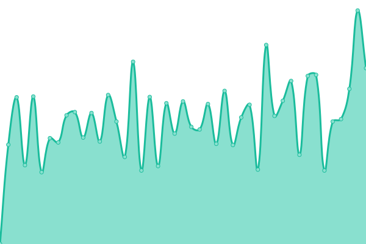 1033ms
     
 | 

<a href="https://AlexJenter.github.io/upptime/history/giubbini-architekten">99.04%</a>
    

|  [Hope Fight Love](https://hopefightlove.ch) | 🟩 Up | [hope-fight-love.yml](https://github.com/AlexJenter/upptime/commits/HEAD/history/hope-fight-love.yml) | 

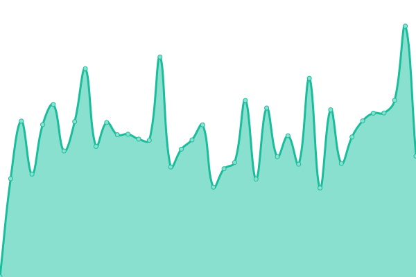 706ms
     
 | 

<a href="https://AlexJenter.github.io/upptime/history/hope-fight-love">99.04%</a>
    

|  [Katrin Luchsinger](https://www.katrinluchsinger.ch) | 🟩 Up | [katrin-luchsinger.yml](https://github.com/AlexJenter/upptime/commits/HEAD/history/katrin-luchsinger.yml) | 

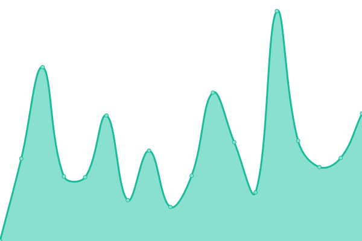 1828ms
     
 | 

<a href="https://AlexJenter.github.io/upptime/history/katrin-luchsinger">100.00%</a>
    

|  [Kiff](https://kiff.ch) | 🟩 Up | [kiff.yml](https://github.com/AlexJenter/upptime/commits/HEAD/history/kiff.yml) | 

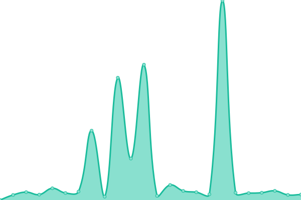 10127ms
     
 | 

<a href="https://AlexJenter.github.io/upptime/history/kiff">96.59%</a>
    

|  [Kiff – We make it](https://kiff2026.ch/) | 🟩 Up | [kiff-we-make-it.yml](https://github.com/AlexJenter/upptime/commits/HEAD/history/kiff-we-make-it.yml) | 

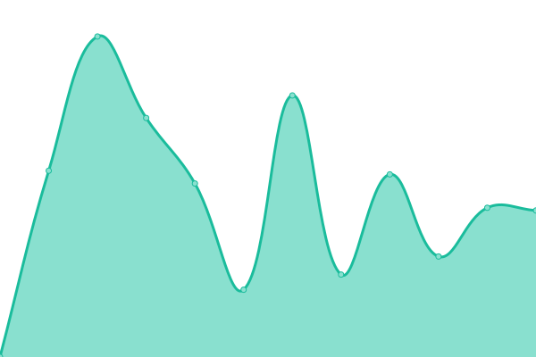 2102ms
     
 | 

<a href="https://AlexJenter.github.io/upptime/history/kiff-we-make-it">100.00%</a>
    

|  [Kilian Ziegler](https://kilianziegler.ch) | 🟩 Up | [kilian-ziegler.yml](https://github.com/AlexJenter/upptime/commits/HEAD/history/kilian-ziegler.yml) | 

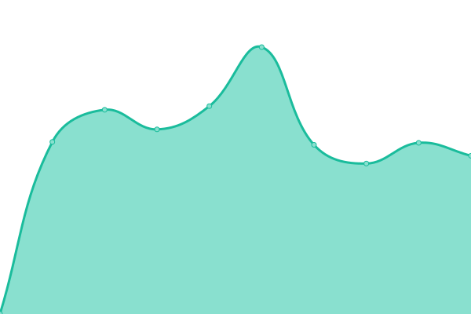 1299ms
     
 | 

<a href="https://AlexJenter.github.io/upptime/history/kilian-ziegler">99.62%</a>
    

|  [KUF Architekten](https://kufarchitekten.ch/) | 🟩 Up | [kuf-architekten.yml](https://github.com/AlexJenter/upptime/commits/HEAD/history/kuf-architekten.yml) | 

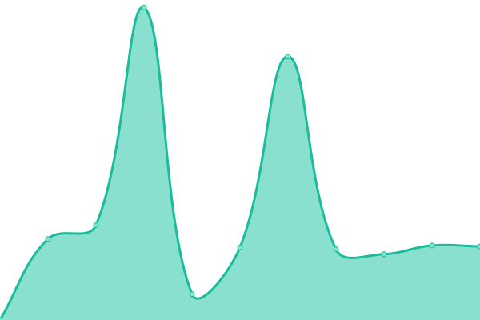 1434ms
     
 | 

<a href="https://AlexJenter.github.io/upptime/history/kuf-architekten">100.00%</a>
    

|  [Lisa Christ](https://www.lisachrist.ch) | 🟩 Up | [lisa-christ.yml](https://github.com/AlexJenter/upptime/commits/HEAD/history/lisa-christ.yml) | 

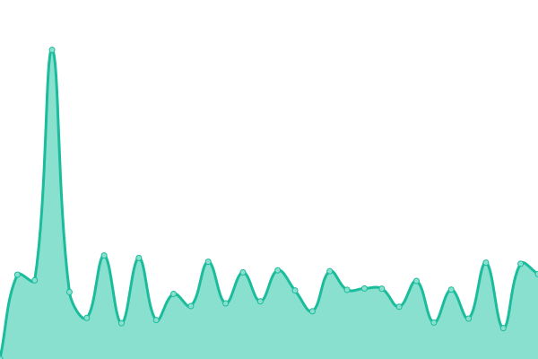 1296ms
     
 | 

<a href="https://AlexJenter.github.io/upptime/history/lisa-christ">98.88%</a>
    

|  [Susanne Boner](https://www.susanneboner.ch/) | 🟩 Up | [susanne-boner.yml](https://github.com/AlexJenter/upptime/commits/HEAD/history/susanne-boner.yml) | 

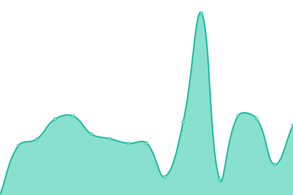 2321ms
     
 | 

<a href="https://AlexJenter.github.io/upptime/history/susanne-boner">100.00%</a>
    

|  [Zentrum Literarische Gegenwart](https://www.zentrumfuerliterarischegegenwart.ch/en) | 🟩 Up | [zentrum-literarische-gegenwart.yml](https://github.com/AlexJenter/upptime/commits/HEAD/history/zentrum-literarische-gegenwart.yml) | 

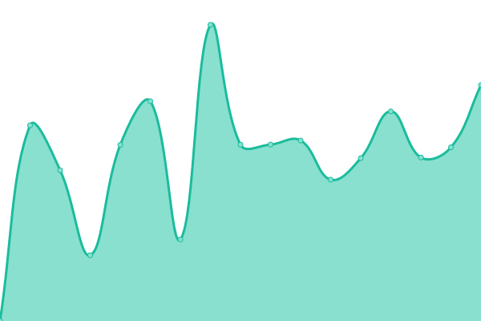 1700ms
     
 | 

<a href="https://AlexJenter.github.io/upptime/history/zentrum-literarische-gegenwart">100.00%</a>
    

|  [Zurich Aesthetics Lab](https://zurichaestheticslab.ch) | 🟩 Up | [zurich-aesthetics-lab.yml](https://github.com/AlexJenter/upptime/commits/HEAD/history/zurich-aesthetics-lab.yml) | 

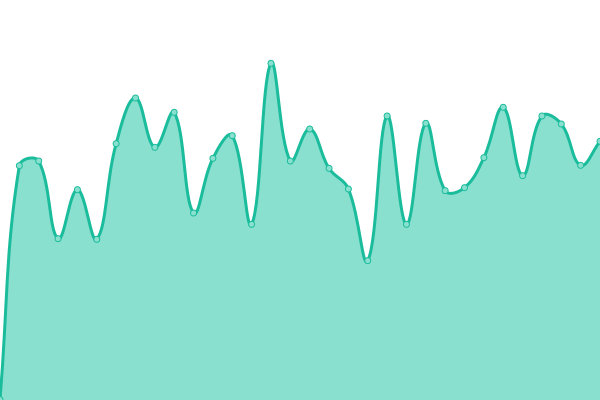 722ms
     
 | 

<a href="https://AlexJenter.github.io/upptime/history/zurich-aesthetics-lab">99.04%</a>
    

<!--end: status pages-->

[**Visit our status website →**](https://AlexJenter.github.io/upptime)

## 📄 License

- Powered by: [Upptime](https://github.com/upptime/upptime)
- Code: [MIT](./LICENSE) © [Anand Chowdhary](https://anandchowdhary.com), supported by [Pabio](https://pabio.com)
- Data in the `./history` directory: [Open Database License](https://opendatacommons.org/licenses/odbl/1-0/)
